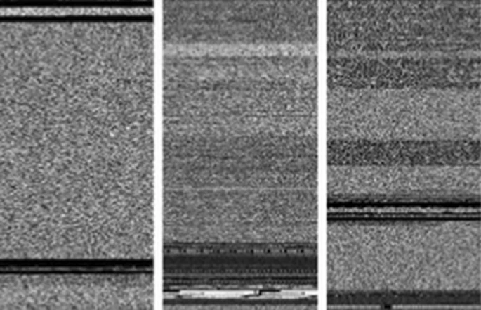

# U-Net in Cybersecurity: Precision Image Segmentation for Enhanced Security Measures

# Executive Summary

This portfolio showcases the application of U-Net, a powerful convolutional neural network architecture, in cybersecurity through precision image segmentation. U-Net's ability to accurately segment images has significant implications for enhancing security measures such as intrusion detection, anomaly detection in network traffic, facial recognition for access control, and digital forensics. This document explores the architecture of U-Net, its applications in cybersecurity, a project demonstration in image segmentation, and future directions for leveraging U-Net in cybersecurity.

## Table of Contents
1. [Introduction](#1-introduction)
   - [1.1 Overview of U-Net](#11-overview-of-u-net)
   - [1.2 Importance of U-Net in Cybersecurity](#12-importance-of-u-net-in-cybersecurity)
2. [U-Net Architecture](#2-u-net-architecture)
   - [2.1 Structure of U-Net](#21-structure-of-u-net)
   - [2.2 Comparison with Regular CNNs](#22-comparison-with-regular-cnns)
3. [Applications of U-Net in Cybersecurity](#3-applications-of-u-net-in-cybersecurity)
   - [3.1 Intrusion Detection](#31-intrusion-detection)
   - [3.2 Anomaly Detection in Network Traffic](#32-anomaly-detection-in-network-traffic)
   - [3.3 Facial Recognition for Access Control](#33-facial-recognition-for-access-control)
   - [3.4 Digital Forensics](#34-digital-forensics)
4. [Project Accomplishment: Image Segmentation with U-Net](#4-project-accomplishment-image-segmentation-with-u-net)
   - [4.1 Objective](#41-objective)
   - [4.2 Tasks Completed](#42-tasks-completed)
   - [4.3 Results](#43-results)
5. [Conclusion](#5-conclusion)
   - [5.1 Summary of Key Points](#51-summary-of-key-points)
   - [5.2 Future Directions](#52-future-directions)
6. [References](#6-references)

## 1. Introduction

### 1.1 Overview of U-Net

U-Net is a convolutional neural network architecture designed for precise image segmentation tasks. Originally developed for biomedical image segmentation, its structure facilitates accurate pixel-level predictions.

### 1.2 Importance of U-Net in Cybersecurity

In cybersecurity, U-Net's capability to segment and analyze images effectively translates into enhanced security measures across various domains, from network security to digital forensics.

## 2. U-Net Architecture

### 2.1 Structure of U-Net

U-Net comprises an encoder-decoder architecture with skip connections, enabling it to capture contextual information and maintain spatial details crucial for segmentation tasks.

### 2.2 Comparison with Regular CNNs

Unlike traditional CNNs that focus on image classification, U-Net predicts labels for each pixel, making it suitable for tasks requiring detailed localization and segmentation.

## 3. Applications of U-Net in Cybersecurity

### 3.1 Intrusion Detection

By treating network data as images, U-Net can detect anomalies in network traffic patterns, aiding in the identification of potential security breaches.

### 3.2 Anomaly Detection in Network Traffic

U-Net's ability to segment network traffic data helps in identifying deviations from normal patterns, crucial for anomaly detection in cybersecurity.

### 3.3 Facial Recognition for Access Control

In access control systems, U-Net enhances facial recognition accuracy by precisely segmenting facial features, improving security in sensitive areas.

### 3.4 Digital Forensics

For digital forensics, U-Net assists in verifying image authenticity and identifying tampering through detailed segmentation and analysis.

Releated Malware Families                             | Unreleated Malware Families
:---------------------------------------------------: | :---------------------------------------------------:
 | 

## 4. Project Accomplishment: Image Segmentation with U-Net

### 4.1 Objective

This project aimed to demonstrate U-Net's effectiveness in semantic image segmentation using the CARLA self-driving car dataset.

### 4.2 Tasks Completed

- Developed a custom U-Net model tailored for semantic segmentation.
- Applied the model to the CARLA dataset, predicting labels for each pixel to differentiate objects within images.

### 4.3 Results

The project successfully showcased U-Net's ability to perform accurate image segmentation, highlighting its potential for enhancing security measures in diverse applications.

## 5. Conclusion

### 5.1 Summary of Key Points

U-Net offers precise segmentation capabilities crucial for cybersecurity applications such as intrusion detection and digital forensics. Its architecture and performance make it a valuable tool for improving security measures.

### 5.2 Future Directions

Further research can expand U-Net's applications in cybersecurity, exploring new methods to convert data into image formats and enhancing threat detection capabilities.

## 6. References

- **Academic Papers and Articles**:
  - [Leon A. Gatys, Alexander S. Ecker, Matthias Bethge, (2015). A Neural Algorithm of Artistic Style](https://arxiv.org/abs/1508.06576)
  - [Harish Narayanan, Convolutional neural networks for artistic style transfer.](https://harishnarayanan.org/writing/artistic-style-transfer/)
  - [Log0, TensorFlow Implementation of "A Neural Algorithm of Artistic Style".](https://www.chioka.in/tensorflow-implementation-neural-algorithm-of-artistic-style)
  - [Karen Simonyan and Andrew Zisserman (2015). Very deep convolutional networks for large-scale image recognition
MatConvNet.
](https://arxiv.org/pdf/1409.1556)
- **Courses**:
  - [Ng, A., Katanforoosh, K., & Mourri, Y. (n.d.). Convolutional Neural Networks. DeepLearning.AI, Coursera.](https://www.coursera.org/learn/convolutional-neural-networks)

- [Cybersecurity Article](https://cybersecurity.springeropen.com/articles/10.1186/s42400-023-00170-z)
- [Research Paper](https://www.researchgate.net/publication/354164057_A_Novel_Way_to_Generate_Adversarial_Network_Traffic_Samples_against_Network_Traffic_Classification/citation/download?_tp=eyJjb250ZXh0Ijp7ImZpcnN0UGFnZSI6Il9kaXJlY3QiLCJwYWdlIjoicHVibGljYXRpb24ifX0)

https://cybersecurity.springeropen.com/articles/10.1186/s42400-023-00170-z

https://www.researchgate.net/publication/354164057_A_Novel_Way_to_Generate_Adversarial_Network_Traffic_Samples_against_Network_Traffic_Classification/citation/download?_tp=eyJjb250ZXh0Ijp7ImZpcnN0UGFnZSI6Il9kaXJlY3QiLCJwYWdlIjoicHVibGljYXRpb24ifX0

